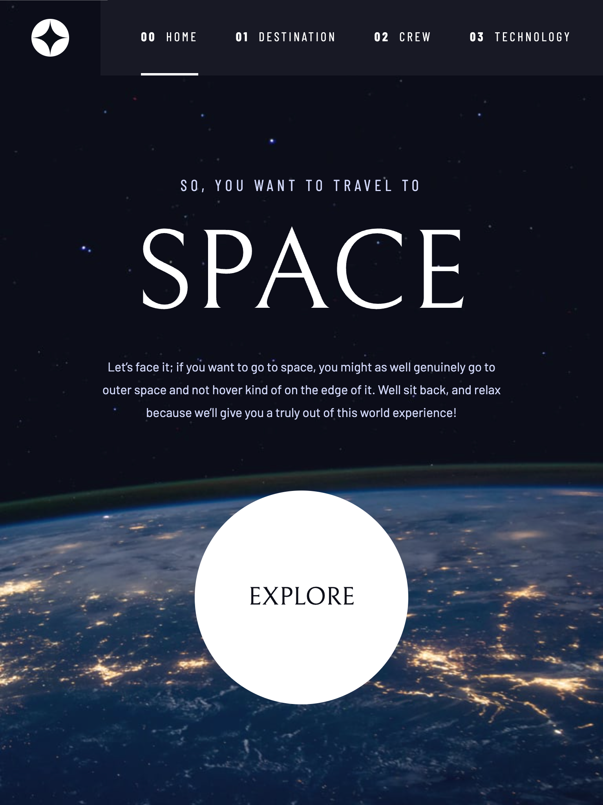
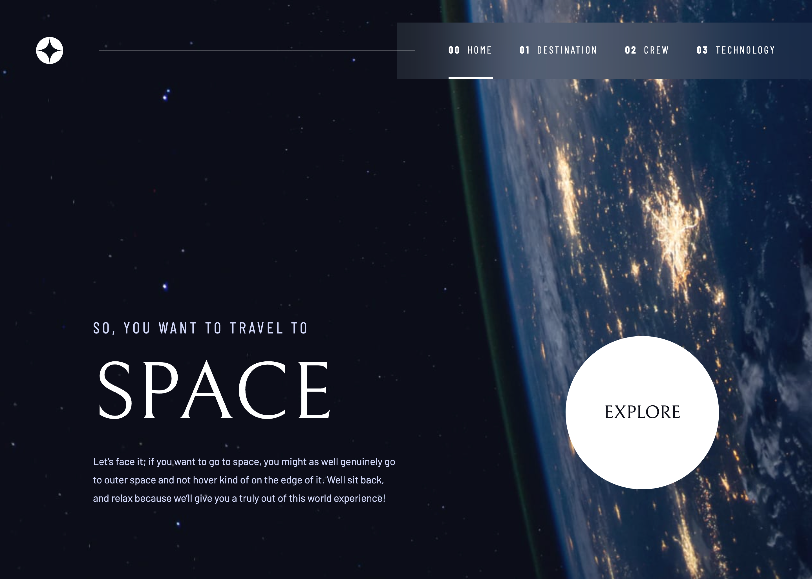

# Frontend Mentor - Space tourism website solution

This is a solution to the [Space tourism website challenge on Frontend Mentor](https://www.frontendmentor.io/challenges/space-tourism-multipage-website-gRWj1URZ3). Frontend Mentor challenges help you improve your coding skills by building realistic projects.

## Table of contents

- [Overview](#overview)
  - [The challenge](#the-challenge)
  - [Screenshots](#screenshots)
  - [Links](#links)
- [My process](#my-process)
  - [Built with](#built-with)
  - [A strong foundation](#a-strong-foundation)
  - [Building on that foundation](#building-on-that-foundation)
  - [What else I learned](#what-else-i-learned)
  - [Continued development](#continued-development)
  - [Useful resources](#useful-resources)
- [Author](#author)

## Overview

### The challenge

Users should be able to:

- View the optimal layout for each of the website's pages depending on their device's screen size
- See hover states for all interactive elements on the page
- View each page and be able to toggle between the tabs to see new information

### Screenshots

|           Mobile designed at 375px:           |          Tablet designed at 1440px:           | Desktop designed at 1440px:                    |
| :-------------------------------------------: | :-------------------------------------------: | ---------------------------------------------- |
|  |  |  |

### Links

- Solution URL: [https://github.com/elisilk/space-tourism-website](https://github.com/elisilk/space-tourism-website)
- Live Site URL: [https://elisilk.github.io/space-tourism-website/](https://elisilk.github.io/space-tourism-website/)

## My process

### Built with

- Semantic HTML5 markup
- CSS custom properties
- Flexbox
- CSS Grid
- Mobile-first workflow
- Accessibility

### A strong foundation

The Frontend Mentor [Advanced CSS techniques](https://www.frontendmentor.io/learning-paths/advanced-css-techniques-vdOtKjIC4V) learning path, presented this challeng following [Performance optimization](https://www.frontendmentor.io/learning-paths/advanced-css-techniques-vdOtKjIC4V/steps/6747d0a9d54b5cb1dee3f39b/article/read) article. Even before getting to the performance aspects of the solution, there was a lot to work through with the multi-page site. Fortunately, there was a great resource available of [Kevin Powell](https://www.kevinpowell.co/) walking through his approach to solving this particular challenge, and so I started with that:

[Build a Space Travel Website with Frontend Mentor by Kevin Powell on Scrimba](https://scrimba.com/build-a-space-travel-website-c014)

With that amazing resource as a foundation, I got most of the way to a full solution.

### Building the Design System

I especially appreciated how Kevin fully (or mostly) implemented the design system first, before working on individual pages. This approach aligns with how the Figma file is set up and with thinking about the solution from a component-based perspective. And it then makes building the individual pages much faster. I added and cleaned up a few things from Kevin's solution in my [final design system page](https://elisilk.github.io/space-tourism-website/design-system.html), including:

- Updating the typography based on the current design file
- Separation of mobile and tablet/desktop versions for both the navigation menu and the display button.
- Added a section on spacing (which I don't end up using in the solution :grimacing:)

### Building on that foundation

Even after that great start, there were a bunch of additional details and other adjustments that I wanted to make that built on and departed from Kevin's solution. I go into some of the major ones below.

#### Strongly Hiding Elements

First, one issue that arose for me while following along with Kevin's implementation, is that I couldn't get my `picture` elements to be [`hidden`](https://developer.mozilla.org/en-US/docs/Web/HTML/Global_attributes/hidden) when they were not associated with the currently-active tab. So all 4 were visible on top of one another.

In the end, I believe it was only working for Kevin because he actually spelled `picture` incorrectly (as "picutre") in his CSS reset. Here is the mispelled section from his code:

```css
/* make images easier to work with */
img,
picutre {
  max-width: 100%;
  display: block;
}
```

So since I included the correct spelling, that solution wasn't working for me. I traced this back to Chris Coyier's explanation that [The `hidden` Attribute is Visibly Weak](https://css-tricks.com/the-hidden-attribute-is-visibly-weak/). Basically, the `display: block` on the `picture` element in the CSS reset was taking precedence over the `hidden` attribute in the HTML. And so the solution for me was to [select all of the elements with that `hidden` attribute](https://stackoverflow.com/questions/24780741/hidden-selectors-in-css) and set their `display` property to `none`, as is done in the [normalize.css](https://necolas.github.io/normalize.css/) reset:

```css
[hidden] {
  display: none;
}
```

So one problem solved. :relieved:

#### Split Second Showing of Mobile Navigation

Admittedly (and as Kevin discusses), most users are not actively changing their viewport size. But, it was still bugging me that as I transitioned from the tablet viewport width to the mobile viewport width (at 560px), the mobile menu would flash for a split second and then translate horizontally off the page. I felt like that split second animation was distracting and not what was intended.

Looking at the CSS for the `.primary-navigation`, I can see why it happens. The element has an initial `transform: translateX(100%);` that gets applied, and then it is translated back when `[data-visible="true"]`. Here is the relevant section of CSS in Kevin's solution:

```css
@media (max-width: 35rem) {
  .primary-navigation {
    --underline-gap: 0.5rem;
    position: fixed;
    z-index: 1000;
    inset: 0 0 0 30%;
    padding: min(20rem, 15vh) 2rem;
    flex-direction: column;
    transform: translateX(100%);
    transition: transform 500ms ease-in-out;
  }

  .primary-navigation[data-visible="true"] {
    transform: translateX(0);
  }
}
```

So is there a way I can make the initial position of `.primary-navigation` to be just off the horizontal end of the page and then only translate it when making it visible? That was my goal.

Instead of using `inset`, I thought that by specifying the width and height and position of the element more directly that I could have better control over the menu's initial position. And more importantly for this issue, I can get rid of that initial transformation. So here is what I came up with.

First, I specify the height and width using [viewport units](https://developer.mozilla.org/en-US/docs/Web/CSS/CSS_Values_and_Units), and then set the inital absolute position as just off the right side of the page (`top: 0; left: 100%;`). And so no `transform` is needed to start. Then, when the mobile menu is visible, I just need to translate horizontally the full width of the element (`transform: translateX(-100%);`). Here is the updated CSS section:

```css
@media (max-width: 35rem) {
  .primary-navigation {
    --underline-gap: 0.5rem;
    position: fixed;
    z-index: 1000;
    height: 100vb;
    width: 70vi;
    top: 0;
    left: 100%;
    padding-block: min(20rem, 15vh);
    padding-inline: 2rem 0;
    flex-direction: column;
    transition: transform 500ms ease-in-out;
  }

  .primary-navigation[data-visible="true"] {
    transform: translateX(-100%);
  }
}
```

Second problem solved. :satisfied:

#### Increasing Clickable Area on Navigation Links and Separating Out Component Classes

I have learned that, in general, it's better to have a larger clickable area around links and buttons than just the icon or text that is the main target. This is especially important for touch screens, but is helpful for mouse interactions too. Ahmad Shadeed has two great guides on this idea:

- [Enhancing The Clickable Area Size by Ahmad Shadeed](https://ishadeed.com/article/clickable-area/)
- [Designing better target sizes by Ahmad Shadeed](https://ishadeed.com/article/target-size/)

The clickable area issue comes up for me in this solution most prominently in the main navigation area. In Kevin's implementation, the block padding was set on the `<li>` elements rather than the `<a>` elements, which doesn't seem ideal to me in terms of clickable area.

But that idea was a little bit complicated because one feature of the design system was to have a general `underline-indicators` component that could work both for a navigation list and a tab list even though they have different underlying HTML structures. The navigation component is made up of a parent `<ul>` with child `<li>` and `<a>` elements (so 3 levels), whereas the tab component is made up of a parent `<div>` with child `<button>` elements (so 2 levels). The tab component follows the ARIA APG Tab Pattern, which makes total sense:

- [ARIA APG Tabs Pattern](https://www.w3.org/WAI/ARIA/apg/patterns/tabs/)

Given the goal of increasing the clickable area and the constraint of the differing HTML structures, my solution was to separate out which CSS applied to the `<a>` and `<button>` elements vs. just the more general direct children of the list element. Even though in some cases those are really the same elements (in the tablist) and in other cases they are not (in the navigation list), separating those out allows for more flexible underlying HTML structure.

Relatedly, I wanted to make sure to separate out what was specific to the `.primary-navigation` component versus the more general `.underline-indicators` component. So for example, the `.underline-indicators` should/can always have a `list-type: none` even though sometimes the class is put on a more general `<div>` element rather than a `<ul>` or `<li>` list element. Similarly, it's okay to set any `<a>` element in the `.underline-indicators` to have a `text-decoration: none;` since that also isn't specific to the `.primary-navigation` block.

Building on that same kind of thinking, it made sense to make an intermediate component class called called `.navigation-list` that was equivalent to the `.tab-list` class. Both of these intermediate-level components would set the more specific padding and spacing requirements than was present in the more general, underlying `.underline-indicators` class.

Third (and fourth :wink:) problem solved. :grin:

Note: I considered taking this idea one step further by creating a new component called `.numbered-item` that would just take care of the typography and spacing of the inner `span` element that contains the number. But, this wasn't specified in the Design System, and although reused in both the `.numbered-title` and `.navigation-list`, it felt like it was okay to not to take this extra step right now. We've done enough! :smirk:

#### Other Areas My Solution Differed from Kevin's

There were a few other areas that I decided to implement differently than Kevin's solution. Without going into too much detail on each, here are some of the other updates I made:

- [x] Changed the breakpoints for the mobile-to-tablet transition and the tablet-to-desktop transition to better match the design and better accommodate the different heading designs and one-vs-two column layout shifts.
- [x] Moved from using `grid-template-areas` to some additional `<div>` container elements to better control the main content area.
- [x] Have all of the page-specific style updates be based on the class used in the page's `<body>` element rather than using the BEM-style classes further down in the HTML structure.
- [x] Based on an [ARIA role issue](https://dequeuniversity.com/rules/axe/4.10/aria-allowed-role) when using `<article>` with a [`role="tabpanel"`](https://developer.mozilla.org/en-US/docs/Web/Accessibility/ARIA/Roles/tabpanel_role), I changed those elements to `<section>` tags, altough I'm thinking that general `<div>` tags might even be more appropriate.

### What else I learned

As always, so many cool 😎 things. Here are some of the other key resources I used as I finished out my solution:

- [emoji-cheat-sheet](https://github.com/ikatyang/emoji-cheat-sheet) :honey_pot: :sparkles:
- Glassmorphism Effect
  - [Next-level frosted glass with `backdrop-filter`](https://www.joshwcomeau.com/css/backdrop-filter/)
  - [How to Create a Glassmorphism Effect with Pure CSS](https://dev.to/drprime01/how-to-create-a-glassmorphism-effect-with-pure-css-eca)
  - [`@supports`](https://developer.mozilla.org/en-US/docs/Web/CSS/@supports)
- [Selecting previous siblings with CSS `:has()`](https://tobiasahlin.com/blog/previous-sibling-css-has/)
- [`<picture>`: The Picture element](https://developer.mozilla.org/en-US/docs/Web/HTML/Element/picture)
- [`scrollbar-gutter`](https://developer.mozilla.org/en-US/docs/Web/CSS/scrollbar-gutter)
- Using masking and gradients to create the fading effect on the crew images
  - [`mask-mode`](https://developer.mozilla.org/en-US/docs/Web/CSS/mask-mode)
  - [Using CSS gradients](https://developer.mozilla.org/en-US/docs/Web/CSS/CSS_images/Using_CSS_gradients)
- Performance
  - [Defer offscreen images](https://developer.chrome.com/docs/lighthouse/performance/offscreen-images/) - Basically, for the images that are in the initially-hidden tabs, it makes sense to set them as [`loading="lazy"`](https://web.dev/articles/browser-level-image-lazy-loading).

### Continued development

Specific areas that the solution should be improved (known issues):

- [ ] Continue to focus on Performance
  - [PageSpeed Insights Report from Feb 2, 2025, 10:53:29 AM](https://pagespeed.web.dev/analysis/https-elisilk-github-io-space-tourism-website-destination-html/ojua4fuw1e)
  - [Optimize Largest Contentful Paint](https://web.dev/articles/optimize-lcp)
- [ ] Minify CSS and JS
- [ ] Download and optimize fonts and build that into my workflow more efficiently
  - [How to Download and Optimize Google Fonts](https://www.aleksandrhovhannisyan.com/blog/downloading-and-optimizing-google-fonts/)
  - [How I set up Glyphhanger on macOS for optimizing and converting font files for the Web](https://www.sarasoueidan.com/blog/glyphhanger/)
  - [It’s Dangerous to Go Stallone. Take Glyphhanger](https://www.zachleat.com/web/glyphhanger/)
  - [glyphhanger](https://github.com/zachleat/glyphhanger)
- [ ] Increase clickable area of any/all links and buttons (e.g. the dots)
- [ ] Confirm text style properties (sizes, letter spacing, etc.) with the current Figma design file
- [ ] Remove the extra inline space created by the font with larger letter spacing
  - [Letter Spacing is Broken and There’s Nothing We Can Do About It… Maybe](https://css-tricks.com/letter-spacing-is-broken-and-theres-nothing-we-can-do-about-it-maybe/)
  - [How can I remove the letter-spacing on the last letter of an `<a>` tag in CSS?](https://stackoverflow.com/questions/37678137/how-can-i-remove-the-letter-spacing-on-the-last-letter-of-an-a-tag-in-css)
- [ ] Use a more JS-heavy approach with the provided local `data.json` file for the different page data. So the data would be pulled from there instead of using separate .html files.
  - [Building an app? These are the best JavaScript frameworks in 2025](https://www.contentful.com/blog/best-javascript-frameworks/) - Of course, [React](https://react.dev/) seems like a great choice. But [Vue.js](https://vuejs.org/) seems like it's worth a try too, and probably easier to get started with.
  - Could I build it with just vanilla JavaScript?
  - Or would a static site generator also be a good option? That way the data is read in from the JSON file when the site is generated, but the final site is just a bunch of static pages.

More general ideas I want to consider:

Hmm 🤔 ...

- When to use container queries vs. media queries?
  - [Container Queries Unleashed](https://www.joshwcomeau.com/css/container-queries-unleashed/)
  - [A Friendly Introduction to Container Queries](https://www.joshwcomeau.com/css/container-queries-introduction/)
  - [Container Query Solutions with CSS Grid and Flexbox](https://moderncss.dev/container-query-solutions-with-css-grid-and-flexbox/)
  - [Using media queries](https://developer.mozilla.org/en-US/docs/Web/CSS/CSS_media_queries/Using_media_queries)

### Useful resources

- [Kevin Powell on YouTube](https://www.youtube.com/@KevinPowell) - He's the best.
- [Accessibility Developer Guide](https://www.accessibility-developer-guide.com/)
- [MDN Web Docs for CSS](https://developer.mozilla.org/en-US/docs/Web/CSS) - Went here a lot to reference the different CSS properties and the shorthands, and all the great explanations about best practices.
- [The Clamp Calculator](https://royalfig.github.io/fluid-typography-calculator/) - Used for all of fluid typography and fluid spacing calculations. I didn't end up using it in this solution, but it's always there when I need it.

## Author

- Website - [Eli Silk](https://github.com/elisilk)
- Frontend Mentor - [@elisilk](https://www.frontendmentor.io/profile/elisilk)
