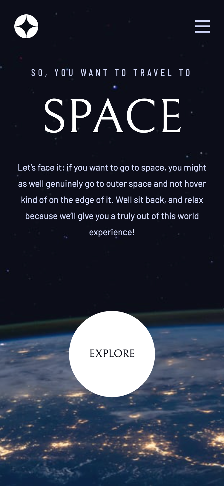

# Frontend Mentor - Space tourism website solution

This is a solution to the [Space tourism website challenge on Frontend Mentor](https://www.frontendmentor.io/challenges/space-tourism-multipage-website-gRWj1URZ3). Frontend Mentor challenges help you improve your coding skills by building realistic projects.

## Table of contents

- [Overview](#overview)
  - [The challenge](#the-challenge)
  - [Screenshots](#screenshots)
  - [Links](#links)
- [My process](#my-process)
  - [Built with](#built-with)
  - [A strong foundation](#a-strong-foundation)
  - [Building on that foundation](#building-on-that-foundation)
  - [What else I learned](#what-else-i-learned)
  - [Continued development](#continued-development)
  - [Useful resources](#useful-resources)
- [Author](#author)

## Overview

### The challenge

Users should be able to:

- View the optimal layout for each of the website's pages depending on their device's screen size
- See hover states for all interactive elements on the page
- View each page and be able to toggle between the tabs to see new information

### Screenshots

|           Mobile designed at 375px:           |          Tablet designed at 1440px:           | Desktop designed at 1440px:                    |
| :-------------------------------------------: | :-------------------------------------------: | ---------------------------------------------- |
|  |  |  |

### Links

- Solution URL: [https://github.com/elisilk/space-tourism-website](https://github.com/elisilk/space-tourism-website)
- Live Site URL: [https://elisilk.github.io/space-tourism-website/](https://elisilk.github.io/space-tourism-website/)

## My process

### Built with

- Semantic HTML5 markup
- CSS custom properties
- Flexbox
- CSS Grid
- Mobile-first workflow
- Accessibility

### A strong foundation

The Frontend Mentor [Advanced CSS techniques](https://www.frontendmentor.io/learning-paths/advanced-css-techniques-vdOtKjIC4V) learning path, presented this challeng following [Performance optimization](https://www.frontendmentor.io/learning-paths/advanced-css-techniques-vdOtKjIC4V/steps/6747d0a9d54b5cb1dee3f39b/article/read) article. Even before getting to the performance aspects of the solution, there was a lot to work through with the multi-page site. Fortunately, there was a great resource available of [Kevin Powell](https://www.kevinpowell.co/) walking through his approach to solving this particular challenge, and so I started with that:

[Build a Space Travel Website with Frontend Mentor by Kevin Powell on Scrimba](https://scrimba.com/build-a-space-travel-website-c014)

With that amazing resource as a foundation, I got most of the way to a full solution.

I especially appreciated the approach of fully implementing the design system first, before working on individual pages, which aligns with how the Figma file is set up and then makes building the individual pages much faster.

### Building on that foundation

But even after that great start, there were a bunch of details and other adjustments that I wanted to make, in addition to thinking about performance as well.

#### Strongly Hiding Elements

First, one issue that arose for me while following along with Kevin's implementation, is that I couldn't get my `picture` elements to be [`hidden`](https://developer.mozilla.org/en-US/docs/Web/HTML/Global_attributes/hidden) when they were not associated with the currently-active tab. In the end, I believe it was only working for Kevin because he actually spelled `picture` incorrectly in his CSS reset:

```css
/* make images easier to work with */
img,
picutre {
  max-width: 100%;
  display: block;
}
```

Chris Coyier's explanation that [The `hidden` Attribute is Visibly Weak](https://css-tricks.com/the-hidden-attribute-is-visibly-weak/) seems to be the issue. And so the solution for me was to [select all of the elements with that `hidden` attribute](https://stackoverflow.com/questions/24780741/hidden-selectors-in-css) and set their `display` property to `none`, as is done in the [normalize.css](https://necolas.github.io/normalize.css/) reset:

```css
[hidden] {
  display: none;
}
```

So one problem solved.

#### Split Second Showing of Mobile Navigation

Admittedly (and as Kevin discusses), most users are not actively changing their viewport size. But, it was still bugging me that as I transitioned from the tablet viewport width to the mobile viewport width (at 560px), the mobile menu would flash for a split second and then translate horizontally off the page. I felt like that split second animation was distracting and now what was intended.

Looking at the CSS for the `.primary-navigation`, I can see why it happens. The element has an initial `transform: translateX(100%);` that gets applied, and then it is translated back when `[data-visible="true"]`:

```css
@media (max-width: 35rem) {
  .primary-navigation {
    --underline-gap: 0.5rem;
    position: fixed;
    z-index: 1000;
    inset: 0 0 0 30%;
    padding: min(20rem, 15vh) 2rem;
    flex-direction: column;
    transform: translateX(100%);
    transition: transform 500ms ease-in-out;
  }

  .primary-navigation[data-visible="true"] {
    transform: translateX(0);
  }
}
```

So is there a way I can make it's initial position to be just off the horizontal end of the page and then only translate it when making it visible? That was my goal.

Instead of using `inset`, I thought that by specifying the width and height and position of the element more directly that I could have better control over the menu's initial position. And more importantly for this issue, I can get rid of that initial transformation. So here is what I came up with. I specify the height and width using [viewport units](https://developer.mozilla.org/en-US/docs/Web/CSS/CSS_Values_and_Units), and then set the inital absolute position as just off the right side of the page (`top: 0; left: 100%;`). Finally, when the mobile menu is visible, I just need to translate horizontally the full width of the element (`transform: translateX(-100%);`). Here is the final CSS code:

```css
@media (max-width: 35rem) {
  .primary-navigation {
    --underline-gap: 0.5rem;
    position: fixed;
    z-index: 1000;
    height: 100vb;
    width: 70vi;
    top: 0;
    left: 100%;
    padding: min(20rem, 15vh) 2rem;
    flex-direction: column;
    transition: transform 500ms ease-in-out;
  }

  .primary-navigation[data-visible="true"] {
    transform: translateX(-100%);
  }
}
```

Second problem solved.

#### Increasing Clickable Area on Navigation Links and Separating Out Component Classes

This is complicated because we want to have this general `underline-indicators` component that should work both for a navigation list and a tab list even though they have different underlying HTML structures.

- [ARIA APG Tabs Pattern](https://www.w3.org/WAI/ARIA/apg/patterns/tabs/)
- [Enhancing The Clickable Area Size by Ahmad Shadeed](https://ishadeed.com/article/clickable-area/)
- [Designing better target sizes by Ahmad Shadeed](https://ishadeed.com/article/target-size/)

So my solution was to separate out which CSS applied to the `a` and `button` elements vs. just the more general direct children of the list element, even though in some cases those are really the same elements (in the tablist) and in other cases they are not (in the navigation list).

Relatedly, I wanted to make sure to separate out what was specific to the `.primary-navigation` component versus the more general `.underline-indicators` component. So for example, the `.underline-indicators` should/can always have a `list-type: none` even though sometimes the class is put on a more general `div` element rather than a `ul` or `li` list element. Similarly, it's okay to set any `a` element in the `.underline-indicators` to have a `text-decoration: none;` since that also isn't specific to the `.primary-navigation` block.

Building on that same kind of thinking, it made sense to make an intermediate component class called called `.navigation-list` that was equivalent to the `.tab-list` class. Both of these intermediate-level components would set the more specific padding and spacing requirements than was present in the more general, underlying `.underline-indicators` class.

Third (and fourth :wink:) problem solved.

Note: I considered taking this idea one step further by creating a new component called `.numbered-item` that would just take care of the typography and spacing of the inner `span` element that contains the number. But, this wasn't specified in the Design System, and although reused in both the `.numbered-title` and `.navigation-list`, it felt like it was okay to not to take this extra step right now. We've done enough! :smirk:

#### Other Areas I Differ from Kevin

- [ ] change the breakpoint for the tablet view from 45em (720px) to 50em (800px) so I can better match the design

### What else I learned

So many cool 😎 things. Here are some of the other key resources I used as I finished out my solution:

- Glassmorphism Effect
  - [Next-level frosted glass with `backdrop-filter`](https://www.joshwcomeau.com/css/backdrop-filter/)
  - [How to Create a Glassmorphism Effect with Pure CSS](https://dev.to/drprime01/how-to-create-a-glassmorphism-effect-with-pure-css-eca)
  - [`@supports`](https://developer.mozilla.org/en-US/docs/Web/CSS/@supports)
- [Selecting previous siblings with CSS `:has()`](https://tobiasahlin.com/blog/previous-sibling-css-has/)
- [`<picture>`: The Picture element](https://developer.mozilla.org/en-US/docs/Web/HTML/Element/picture)
- [`scrollbar-gutter`](https://developer.mozilla.org/en-US/docs/Web/CSS/scrollbar-gutter)
- Clickable areas
  - [Enhancing The Clickable Area Size by Ahmad Shadeed](https://ishadeed.com/article/clickable-area/)
  - [Designing better target sizes by Ahmad Shadeed](https://ishadeed.com/article/target-size/)

### Continued development

Specific areas that the solution should be improved (known issues):

- [ ] Minify CSS and JS
- [ ] Download and optimize fonts
- [ ] Increase clickable area of links and buttons (and all the tabs, dots, etc.)
- [ ] Confirm text style properties (sizes, letter spacing, etc.) with the current Figma design file
- [ ] Use a more JS-heavy approach with the provided local `data.json` file for the different page data. So the data would be pulled from there instead of using separate .html files.

More general ideas I want to consider:

Hmm 🤔 ...

### Useful resources

- [Kevin Powell on YouTube](https://www.youtube.com/@KevinPowell) - He's the best.
- [Accessibility Developer Guide](https://www.accessibility-developer-guide.com/)
- [MDN Web Docs for CSS](https://developer.mozilla.org/en-US/docs/Web/CSS) - Went here a lot to reference the different CSS properties and the shorthands, and all the great explanations about best practices.
- [The Clamp Calculator](https://royalfig.github.io/fluid-typography-calculator/) - Used for all of fluid typography and fluid spacing calculations. I didn't end up using it in this solution, but it's always there when I need it.

## Author

- Website - [Eli Silk](https://github.com/elisilk)
- Frontend Mentor - [@elisilk](https://www.frontendmentor.io/profile/elisilk)
